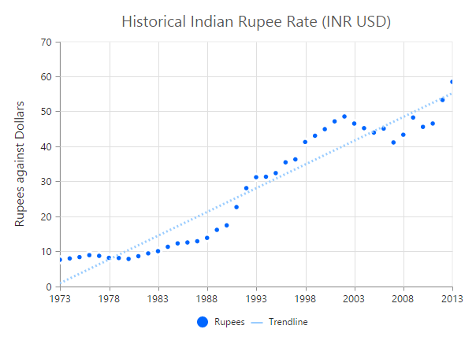
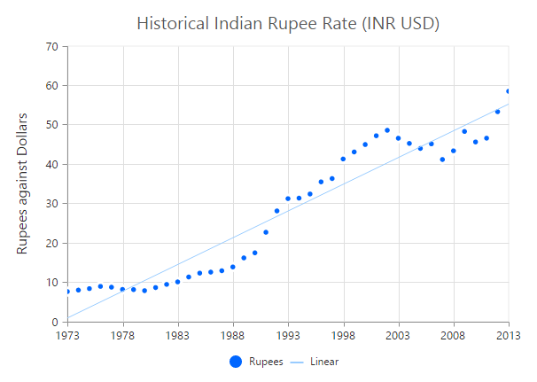
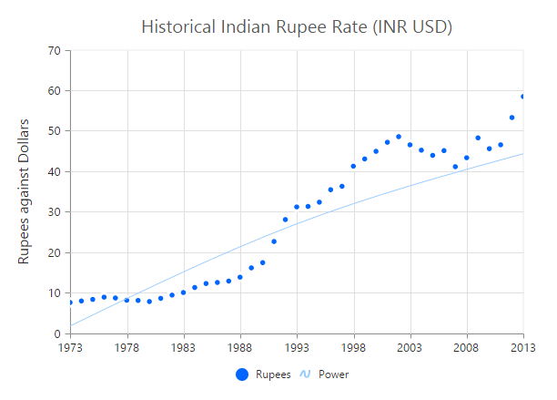

# Trendlines in ReactJS Chart

EjChart can generate Trendlines for Cartesian type series *(Line, Column, Scatter, Area, Candle, HiLo etc.)* except bar type series. You can add more than one trendline object to the [`trendlines`](../api/ejchart#members:series-trendlines) option.



"use strict";
        var series=[{
              trendlines: [{
                   //Enable Trendline to chart series
                   visibility: "visible", type: "linear"
                 }],
            //...
          }];   
         //...  	
		ReactDOM.render(
			<EJ.Chart id="default_chart_sample_0"
			series={series}
			>        
            
			</EJ.Chart>,
				document.getElementById('chart')
		);



[Click](http://js.syncfusion.com/demos/web/#!/azure/chart/trendlines) here to view the Trendlines online demo sample.

## Customize the trendline styles

A trendline can be customized by using the properties such as [`fill`](../api/ejchart#members:series-trendlines-fill), [`width`](../api/ejchart#members:series-trendlines-width), **dashArray** and **opacity**. The default type of trendline is **"linear"**.



"use strict";
        var series=[{
              trendlines: [{
                    //...
                    //Customize the Trendline styles
                    fill: '#99CCFF', width: 3, opacity: 1, dashArray: '2,3'
                 }],
            //...
          }];   
         //...  	
		ReactDOM.render(
			<EJ.Chart id="default_chart_sample_0"
			series={series}
			>        
            
			</EJ.Chart>,
				document.getElementById('chart')
		  );



## Types of Trendline

EjChart supports the following type of Trendlines.

* Linear
* Exponential
* Logarithmic
* Power 
* Polynomial
* MovingAverage

### Linear

To render Linear Trendline, you have to set the [`type`](../api/ejchart#members:series-trendlines-type) as **"linear"**. 



"use strict";
        var series=[{
              trendlines: [{
                    //Change Trendline type
                    type: "linear"
                 }],
            //...
          }];   
         //...  	
		ReactDOM.render(
			<EJ.Chart id="default_chart_sample_0"
			series={series}
			>        
            
			</EJ.Chart>,
				document.getElementById('chart')
		);



### Exponential

Exponential Trendline can be rendered by setting the [`type`](../api/ejchart#members:series-trendlines-type) as **"exponential"**. 



"use strict";
        var series=[{
              trendlines: [{
                    //Change Trendline type
                    type: "exponential"
                 }],
            //...
          }];   
         //...  	
		ReactDOM.render(
			<EJ.Chart id="default_chart_sample_0"
			series={series}
			>        
            
			</EJ.Chart>,
				document.getElementById('chart')
		);



### Logarithmic

Logarithmic Trendline can be rendered by setting the [`type`](../api/ejchart#members:series-trendlines-type) as **"Logarithmic"**.  



"use strict";
        var series=[{
              trendlines: [{
                    //Change Trendline type
                    type: "logarithmic"
                 }],
            //...
          }];   
         //...  	
		ReactDOM.render(
			<EJ.Chart id="default_chart_sample_0"
			series={series}
			>        
            
			</EJ.Chart>,
				document.getElementById('chart')
		);



### Power

Power Trendline can be rendered by setting the [`type`](../api/ejchart#members:series-trendlines-type) of the trendline as **"power"**. 



"use strict";
        var series=[{
              trendlines: [{
                    //Change Trendline type
                    type: "power"
                 }],
            //...
          }];   
         //...  	
		ReactDOM.render(
			<EJ.Chart id="default_chart_sample_0"
			series={series}
			>        
            
			</EJ.Chart>,
				document.getElementById('chart')
		);



### Polynomial

Polynomial Trendline can be rendered by setting the trendline [`type`](../api/ejchart#members:series-trendlines-type) as **"polynomial"**.  You can change the polynomial order by using the **polynomialOrder** of the trendlines. It ranges from 2 to 6.



"use strict";
        var series=[{
              trendlines: [{
                    //Change Trendline type
                    type: "polynomial"
                 }],
            //...
          }];   
         //...  	
		ReactDOM.render(
			<EJ.Chart id="default_chart_sample_0"
			series={series}
			>        
            
			</EJ.Chart>,
				document.getElementById('chart')
		);



### MovingAverage

MovingAverage Trendline can be rendered by setting the [`type`](../api/ejchart#members:series-trendlines-type) of the trendline as **"movingAverage"**. 



"use strict";
        var series=[{
              trendlines: [{
                    //Change Trendline type and set [`period`](../api/ejchart#members:series-trendlines-period) for moving average
                    type: "movingAverage", period: 3
                 }],
            //...
          }];   
         //...  	
		ReactDOM.render(
			<EJ.Chart id="default_chart_sample_0"
			series={series}
			>        
            
			</EJ.Chart>,
				document.getElementById('chart')
		);



## Forecasting

**Trendline forecasting** is the prediction of future/past situations.  **Forecasting** can be classified into two types as follows.

  * Forward Forecasting
  * Backward Forecasting

### Forward Forecasting

The value set for [`forwardForecast`](../api/ejchart#members:series-trendlines-forwardForecast) is used to determine the distance moving towards the future trend.



"use strict";
        var series=[{
              trendlines: [{
                    //...
                    //Set forward forecasting value
                    forwardForecast: 5
                 }],
            //...
          }];   
         //...  	
		ReactDOM.render(
			<EJ.Chart id="default_chart_sample_0"
			series={series}
			>        
            
			</EJ.Chart>,
				document.getElementById('chart')
		);



### Backward Forecasting

The value set for the [`backwardForecast`](../api/ejchart#members:series-trendlines-backwardForecast) is used to determine the past trends.



"use strict";
        var series=[{
              trendlines: [{
                    //...
                    //Set backward forecasting value
                    backwardForecast: 5
                 }],
            //...
          }];   
         //...  	
		ReactDOM.render(
			<EJ.Chart id="default_chart_sample_0"
			series={series}
			>        
            
			</EJ.Chart>,
				document.getElementById('chart')
		);



## Trendlines Legend

To display the legend item for trendline, use the [`name`](../api/ejchart#members:series-trendlines-name) property. You can interact with the trendline legends similar to the series legends *(show/hide trendlines on legend click)*.  



"use strict";
    var series=[{
            trendlines: [{
                 //...
                 //Set Trendline name to display in the legend
                 name: 'Linear'
            }],
        //...
    }];   
    //...  	
		ReactDOM.render(
			<EJ.Chart id="default_chart_sample_0"
			series={series}
			>        
            
			</EJ.Chart>,
				document.getElementById('chart')
		);



