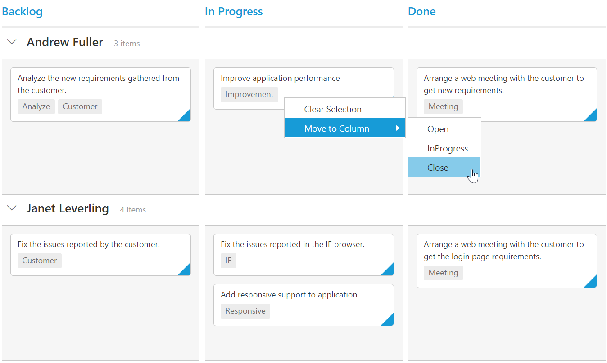

# Context Menu  

Context menu is used to improve user action with Kanban using popup menu. It can be shown by defining [`contextMenuSettings-enable`](https://help.syncfusion.com/api/js/ejkanban#members:contextmenusettings-enable) as true. Context menu has option to add default items in [`contextMenuSettings-menuItems`](https://help.syncfusion.com/api/js/ejkanban#members:contextmenusettings-menuitems) and customized items in [`contextMenuSettings-customMenuItems`](https://help.syncfusion.com/api/js/ejkanban#members:contextmenusettings-custommenuitems).

## Default Context Menu items

Please find the below table for default context menu items and its actions.

<table>
        <tr>
            <th>
                Section 
            </th>
            <th>
               Context menu items 
            </th>
            <th>
                Action
            </th>
        </tr>
        <tr>
            <td rowspan="2">
                Header 
            </td>
            <td>
                Hide Column
            </td>
            <td>
               Hide the current column 
            </td>
        </tr>
        <tr>
            <td>
                Visible Columns
            </td>
            <td>
                Show the column if already hidden 
            </td>
        </tr>
       <tr>
            <td>
                Content
            </td>
            <td>
                Add Card 
            </td>
             <td>
                Start Add new card 
            </td>
        </tr>
        <tr>
            <td rowspan="10">
                Card
            </td>
            <td>
               Edit Card 
            </td>
            <td>
               Start Edit in current card 
            </td>
        </tr>
        <tr>
            <td>
               Delete Card 
            </td>
            <td>
                Delete the current card 
            </td>
        </tr>
        <tr>
            <td>
                Top of Row
            </td>
            <td>
                Move the card to Top of Row
            </td>
        </tr>
        <tr>
            <td>
               Bottom of Row
            </td>
            <td>
                Move the card to Bottom of Row
            </td>
        </tr>
        <tr>
            <td>
               Move Up
            </td>
            <td>
                Move the card in Up direction 
            </td>
        </tr>
        <tr>
            <td>
               Move Down
            </td>
            <td>
               Move the card in Down direction
            </td>
        </tr>
        <tr>
            <td>
                Move Left
            </td>
            <td>
                Move the card in Left direction
            </td>
        </tr>
        <tr>
            <td>
               Move Right
            </td>
            <td>
                Move the card in Right direction
            </td>
        </tr>
        <tr>
            <td>
              Move Swimlane
            </td>
            <td>
                Move the card to Swim lane which is chosen from given list
            </td>
        </tr>
         <tr>
            <td>
              Print Card
            </td>
            <td>
                Print the specific card
            </td>
        </tr>
    </table>

    
The following code example describes the above behavior.



var data = ej.DataManager(window.kanbanData).executeLocal(ej.Query().take(20));
var editItems = [
                            { field: "Id", editType: ej.Kanban.EditingType.String,validationRules: { required: true, number: true }},
                            { field: "Status", editType: ej.Kanban.EditingType.Dropdown },
                            { field: "Assignee", editType: ej.Kanban.EditingType.Dropdown },
                            { field: "Estimate", editType: ej.Kanban.EditingType.Numeric, editParams: { decimalPlaces: 2 },validationRules: {range: [0, 1000]}},
                            { field: "Summary", editType: ej.Kanban.EditingType.TextArea,validationRules: { required: true}}
							];
ReactDOM.render(
<EJ.Kanban dataSource={data} keyField="Status" fields-content="Summary" fields-primaryKey="Id" fields-priority="RankId" editSettings-editItems={editItems} editSettings-allowEditing={true} editSettings-allowAdding={true} contextMenuSettings-enable={true}>
    <columns>
		<column headerText="Backlog" key="Open"></column>
		<column headerText="In Progress" key="InProgress"></column>
		<column headerText="Testing" key="Testing"></column>
	    <column headerText="Done" key="Close"></column>
	</columns>
</EJ.Kanban>,
   document.getElementById('kanbanboard-default')
);



The following output is displayed as a result of the above code example.

## Custom Context Menu

Custom context menu is used to create your own menu item and its action. To add customized context menu items, you need to use [`contextMenuSettings-customMenuItems`](https://help.syncfusion.com/api/js/ejkanban#members:contextmenusettings-custommenuitems) property and to bind required actions for this, use [`contextClick`](https://help.syncfusion.com/api/js/ejkanban#events:contextclick) event.

The following code example describes the above behavior.



 var data = ej.DataManager(window.kanbanData).executeLocal(ej.Query().take(20));
var editItems = [
                    { field: "Id"},
                    { field: "Status", editType: ej.Kanban.EditingType.Dropdown },
                    { field: "Assignee", editType: ej.Kanban.EditingType.Dropdown },
                    { field: "Estimate", editType: ej.Kanban.EditingType.Numeric },
                    { field: "Summary", editType: ej.Kanban.EditingType.TextArea }
			    ];
var customMenuItem = [{ text: "Clear Selection" }];
var menuItem = [];
function contextClick(args) {
	if (args.text == "Clear Selection")
        this.KanbanSelection.clear();
 }
ReactDOM.render(
<EJ.Kanban dataSource={data} keyField="Status" fields-content="Summary" fields-primaryKey="Id" fields-priority="RankId" fields-swimlaneKey="Assignee" editSettings-editItems={editItems} editSettings-allowEditing={true} editSettings-allowAdding={true} contextMenuSettings-enable={true} contextMenuSettings-customMenuItems={customMenuItem} contextMenuSettings-menuItems={menuItem} contextClick={contextClick}>
    <columns>
		<column headerText="Backlog" key="Open"></column>
		<column headerText="In Progress" key="InProgress"></column>
	    <column headerText="Done" key="Close"></column>
	</columns>
</EJ.Kanban>,
   document.getElementById('kanbanboard-default')
);



The following output is displayed as a result of the above code example.

## Sub Context Menu

Sub context menu is used to add customized sub menu to the custom context menu item. To add a sub context menu, you need to use [`contextMenuSettings-subMenu`](https://help.syncfusion.com/api/js/ejkanban#members:contextmenusettings-custommenuitems-template) property and to bind required actions for this, use [`contextClick`](https://help.syncfusion.com/api/js/ejkanban#events:contextclick) event.

The following code example describes the above behavior.



var data = ej.DataManager(window.kanbanData).executeLocal(ej.Query().take(20));
var editItems = [
                    { field: "Id"},
                    { field: "Status", editType: ej.Kanban.EditingType.Dropdown },
                    { field: "Assignee", editType: ej.Kanban.EditingType.Dropdown },
                    { field: "Estimate", editType: ej.Kanban.EditingType.Numeric },
                    { field: "Summary", editType: ej.Kanban.EditingType.TextArea }
			    ];
var customMenuItem = [{ text: "Clear Selection" }, { text: "Move to Column", template: "#submenu"}];
var menuItem = [];
function contextClick(args) {
                if (args.text == "Clear Selection")
                    this.KanbanSelection.clear();
                else if (args.text != "Move to Column")
                    this.updateCard(args.data.id, args.data);
            }
ReactDOM.render(
<EJ.Kanban dataSource={data} keyField="Status" fields-content="Summary" fields-primaryKey="Id" fields-priority="RankId" fields-swimlaneKey="Assignee" editSettings-editItems={editItems} editSettings-allowEditing={true} editSettings-allowAdding={true} contextMenuSettings-enable={true} contextMenuSettings-customMenuItems={customMenuItem} contextMenuSettings-menuItems={menuItem} contextClick={contextClick}>
    <columns>
		<column headerText="Backlog" key="Open"></column>
		<column headerText="In Progress" key="InProgress"></column>
	    <column headerText="Done" key="Close"></column>
	</columns>
</EJ.Kanban>,
   document.getElementById('kanbanboard-default')
);





<ul id="submenu">
    <li><a>Open</a></li>
    <li><a>InProgress</a></li>
    <li><a>Close</a></li>
</ul>



The following output is displayed as a result of the above code example.

