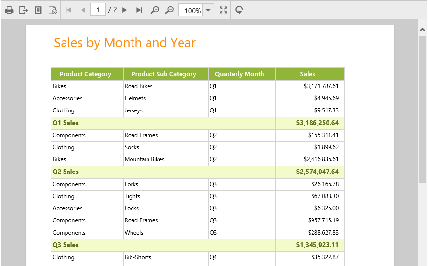
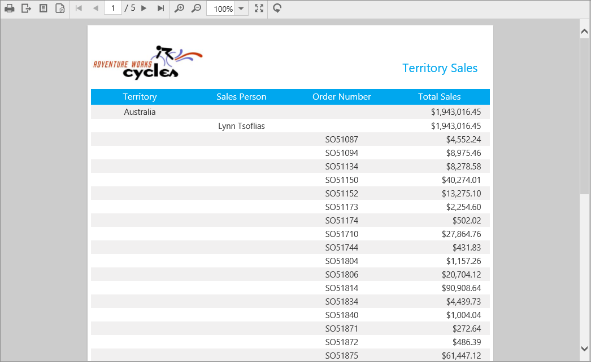

# Getting Started

This section explains briefly about how to create a ReportViewer in React JS.

## Script and CSS Reference

Create a **HTML** page and add the script and CSS references in the order mentioned in the following code example.



<!DOCTYPE html>
<html>
    <head>
        <!-- Essential Studio for JavaScript  theme reference -->
        <link rel="stylesheet" href="http://cdn.syncfusion.com/14.3.0.49/js/web/bootstrap-theme/ej.web.all.min.css" />           
        <!--  react script  -->
        
        
        
        <!--  jquery script  -->
        
        <!-- Essential JS UI widget -->    
        
        

        <!--Add custom scripts here -->
    </head>
    <body>
    </body>
</html>



In the above code, `ej.web.all.min.js` script reference has been added for demonstration purpose. It is not recommended to use this for deployment purpose, as its file size is larger since it contains all the widgets. Instead, you can use [CSG](http://csg.syncfusion.com/# "") utility to generate a custom script file with the required widgets for deployment purpose.

**Note:**

* `react.js` and `react-dom.js` are the core files needed to create react elements.
* `browser.min.js` file is required for code transform.
* `ej.web.react.min.js`  is a react-syncfusion bridge to render Syncfusion components.

### Control Initialization

Add a `div` container to render the ReportViewer.



<!DOCTYPE html>
<html>    
     <body>
         

     </body>
</html>



Initialize the ReportViewer by using the ` EjReportViewer` tag.



<!DOCTYPE html>
<html>
<head>
    
</head>
<body>        
        

   
        
</body>
</html>



N> Default RDL Report will be rendered, which is used in the online service. You can obtain sample rdl/rdlc files from Syncfusion installed location (%userprofile%\AppData\Local\Syncfusion\EssentialStudio\{{ site.releaseversion }}\Common\Data\ejReportTemplate).

### Run the Application

Run the sample application and you can see the ReportViewer on the page as displayed in the following screenshot.

 

ReportViewer with Grouping Aggregate Report
{:.caption}

## Load SSRS Server Reports

ReportViewer supports to load RDL/RDLC files from SSRS Server. The following steps help you to load reports from SSRS Server.

1. Set the `reportPath` from SSRS and SSRS `reportServerUrl` in the ReportViewer properties.



<!DOCTYPE html>
<html>
<head>
    
</head>
<body>        
        

   
        
</body>
</html>



2. Run the application and you can see the ReportViewer on the page as displayed in the following screenshot.

    
   
   Report from SSRS
   {:.caption}

## Load RDLC Reports

The ReportViewer has data binding support to visualize the RDLC reports. The following code example helps you to bind data to ReportViewer.

1. Assign the RDLC report path to ReportViewer’s `reportPath` property and set the data sources to the ReportViewer’s `dataSources` property and specify the `processingMode` as local.



<!DOCTYPE html>
<html>
<head>
    
</head>
<body>        
        

   
        
</body>
</html>



N> Default RDLC Report will be rendered, which is used in the online service.

2. Run the application and you can see the ReportViewer on the page as displayed in the following screenshot.

    
   
   Area Chart RDLC Report
   {:.caption}

